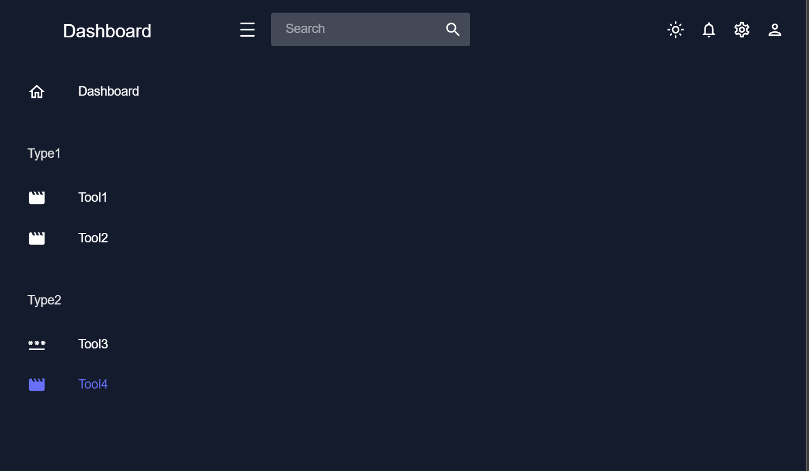

# ReactDashboardTemplate_1

This is a React Dashboard Structure Template for self-use.

Library used: Material UI , react-rounterdom

File Streucture:

- components folder : Reusable components
- scenes folder : page components
- theme.js : contain dark and light theme colors and theme
